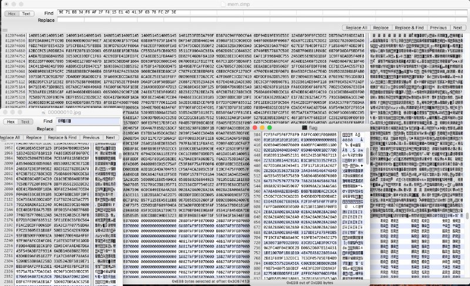

# My solution for challenge "Bad memories 3"

The steps taken for this task:
1. Let's run Foremost and Scalpel to carve some data. 
2. After looking at carved data, we can see 2 interesting JPEG files: bmp and jpeg files with NIXU label. Therefore, we though that the flag should be image file.
3. We use HEXFind for viewing the hex of file. Let's create the emptry JPEG file flag.jpg and try to reconstruct the whole image based on the hints that we got from running Scalpel. 
4. We recovered some flag parts from relevant info. 
5. Now let's recover the full flag from other relevant data. After analyzing the hex, several tryouts and research of JPEG file format, we were able to get the final flag.

# The flag image
NIXU{c4n_you_3nhanc3_this}

