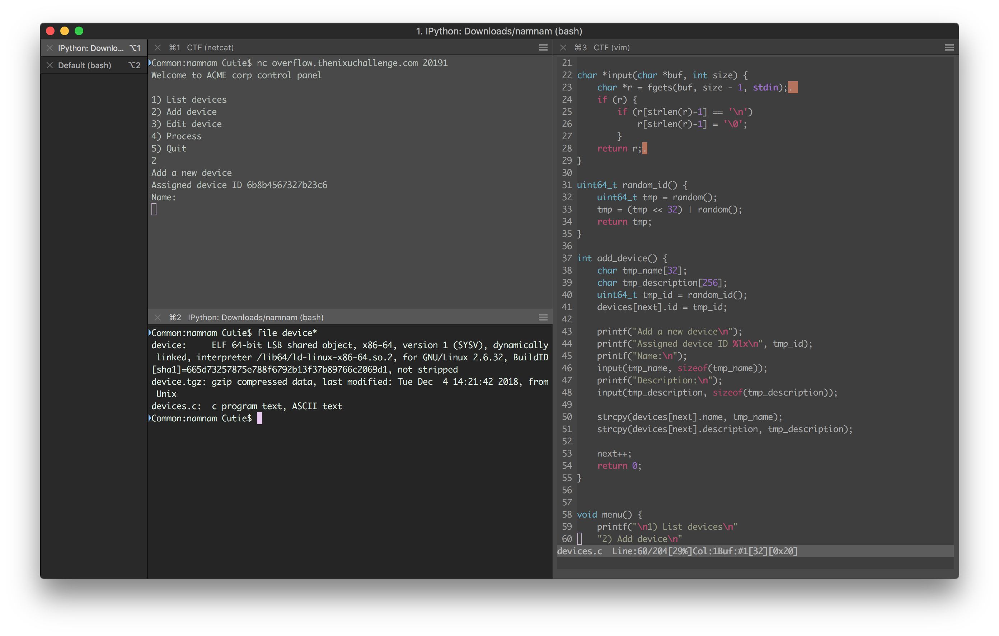
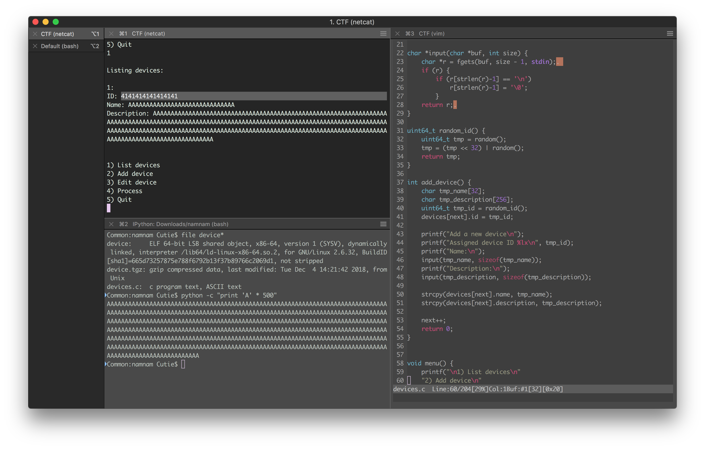
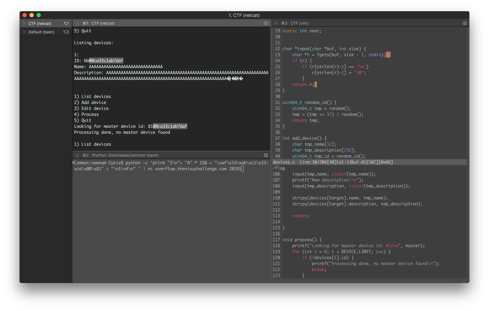

# The solution for "Device Control Pwnel-2" challenge.

## Step
1. We download the file and extract it. Then we see 2 files: source code and L64 bit binary. The device binary is interesting.
2. Let's see the service. We found out that we can add, move or remove devices. 
3. We wanted to print a very long string and figured out that there is a buffer overflow there.
4. The ID of device was overwritten. Let's find the size of buffer. We overwrote the 'Description' part of device. After trials and errors, 258 is the size of buffer. 
5. We look at the script and we try to inject it. We try to inject the whole thing. 
6. In the procees N 4, the master device was provided. After trying to inject the id into master id once and fail, we found out that this point of attack is not possible due to having 0's in id. 

7. Then we found out that 'Edit' command of device also has the same vulnerability.We perform the same attack there. The flag was found there: !(flag)[flag.png]

## Flag
The flag that we obtained is NIXU{h0w_t0_d3al_w1th_null_byt3s\x00}
