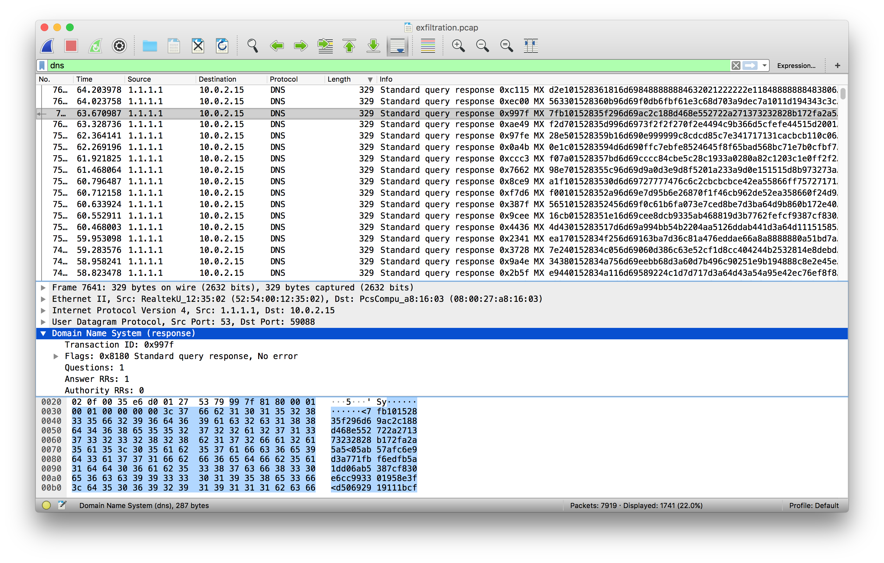
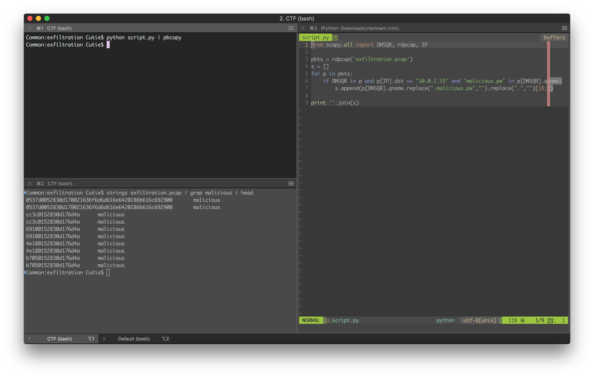
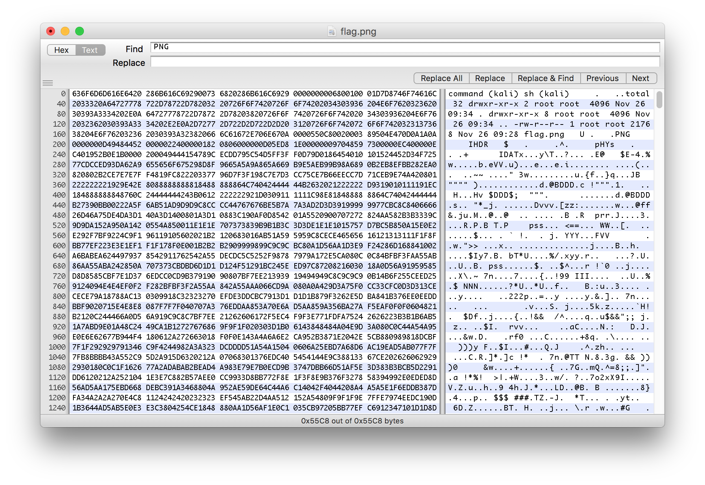

# The solution for "Exfiltration" challenge.

## Steps
1. We get a pcap file, we open it in wireshark and start looking around. Nothing looks suspicious from the tcp stream, but by taking a look
at the DNS messages we start to notice something. 
2. Ok, so there seems to be DNS tunneling going on. We run strings on the pcap and grep for "malicious" and we some hexascii messages.
3. We write a quick script using scapy to get all the required messages, removing the duplicates. 
4. We fire up hexfiend and enter the aquired messages, we remove the unnecessary segments and save get the flag. 

## Flag
The flag that we obtained is NIXU{just_another_tunneling_technique}
