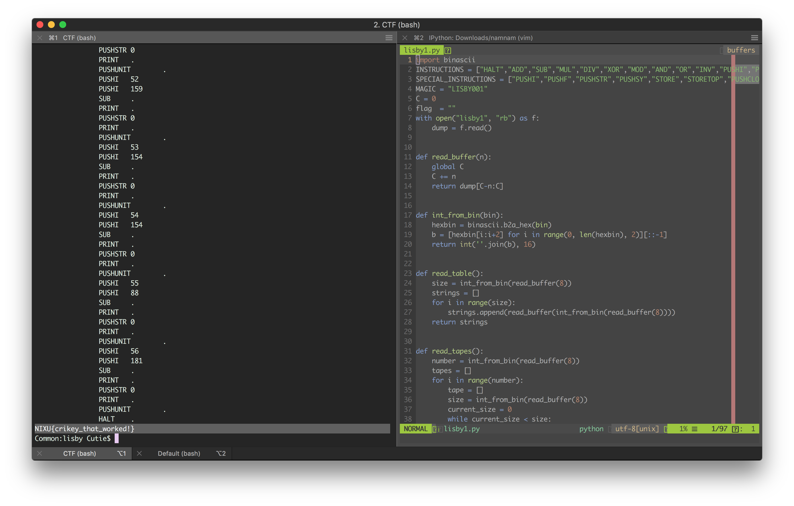

# The solution for "Lisby-1" challenge.

## Step
1. This is a straight forward problem, we are given the instructions for a lisby device and a lisby comiled program, so we explore the specifications.
2. After that we start implementing a decompiler according to the specifications.
3. By running the decompiler and taking a at the assembly code, the function of the program is trivial, so we implement a custom 'solve' function that outputs the flag. 

## Flag
The flag that we obtained is NIXU{crikey_that_worked!}
