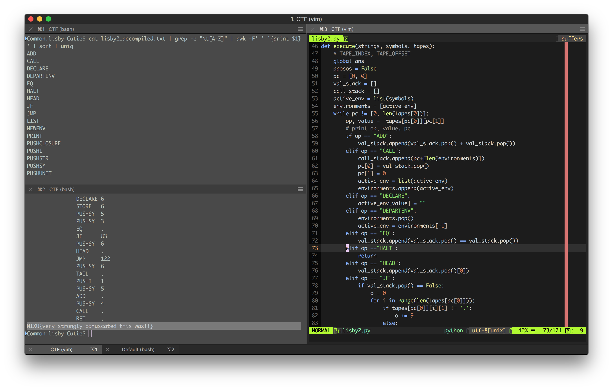

# The solution for "Device Control Pwnel" challenge.

## Step
1. Using our code from Lisby-1 we decompile the program and look at the assembly.
2. It seems a little more complicated than Lisby-1 but instead of analyzing it, we make an execute function that acts accordring to the specifications.
3. Instead of implementing every op code function, we grep for the unique operations in the disassembled file and implement those. 
4. By running our script again we get the flag. 

## Flag
The flag that we obtained is NIXU{very_strongly_obfuscated_this_was!!}
