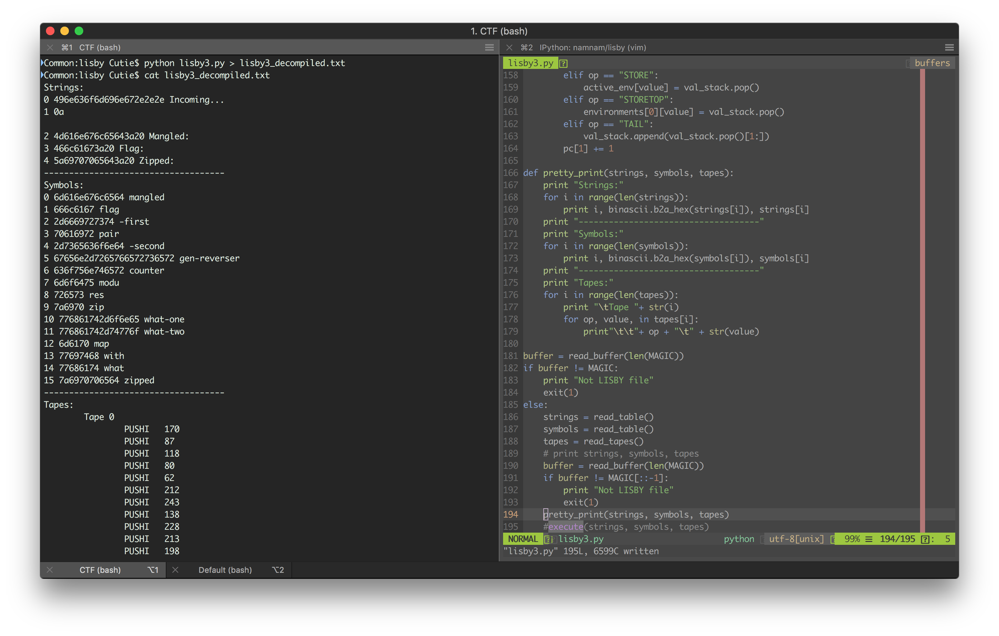
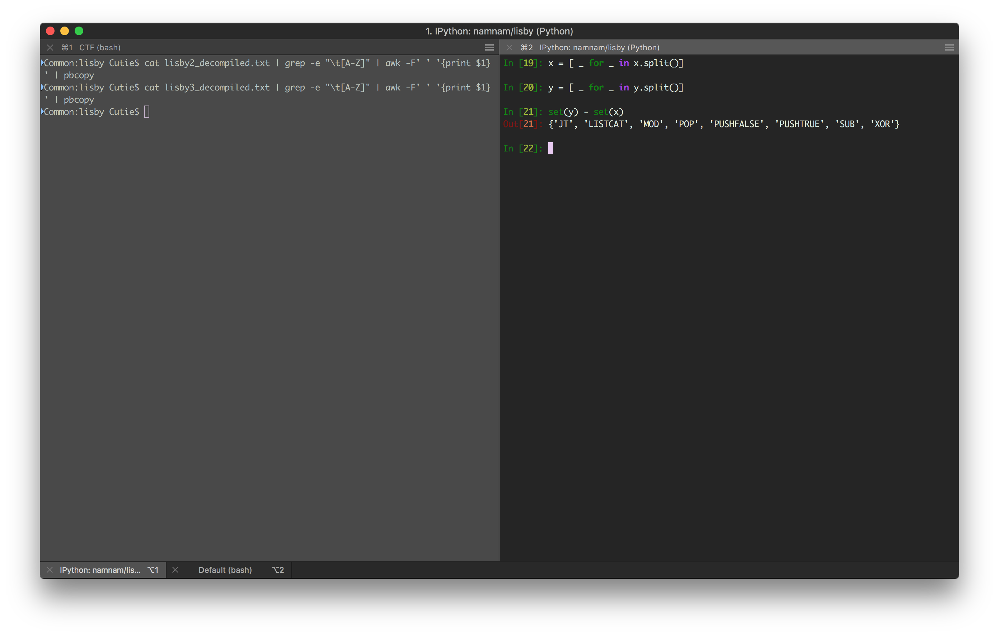
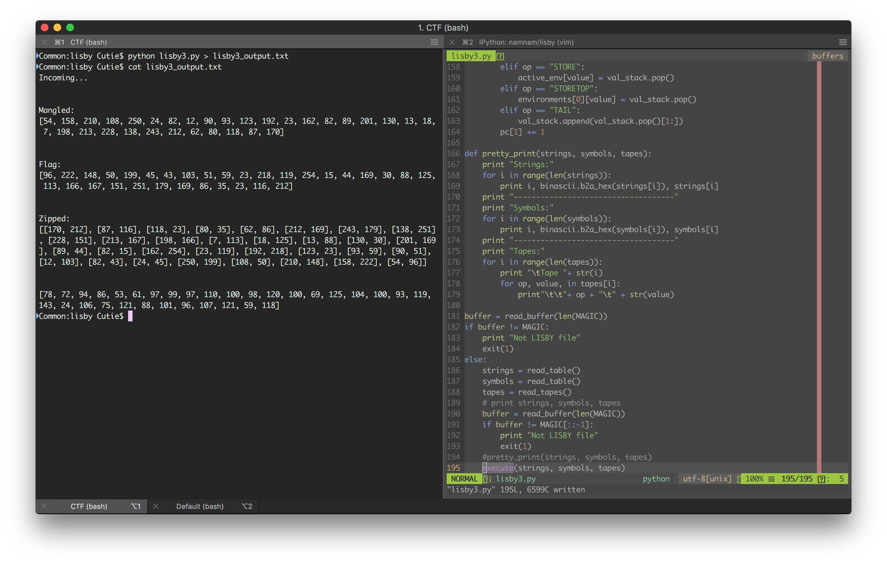
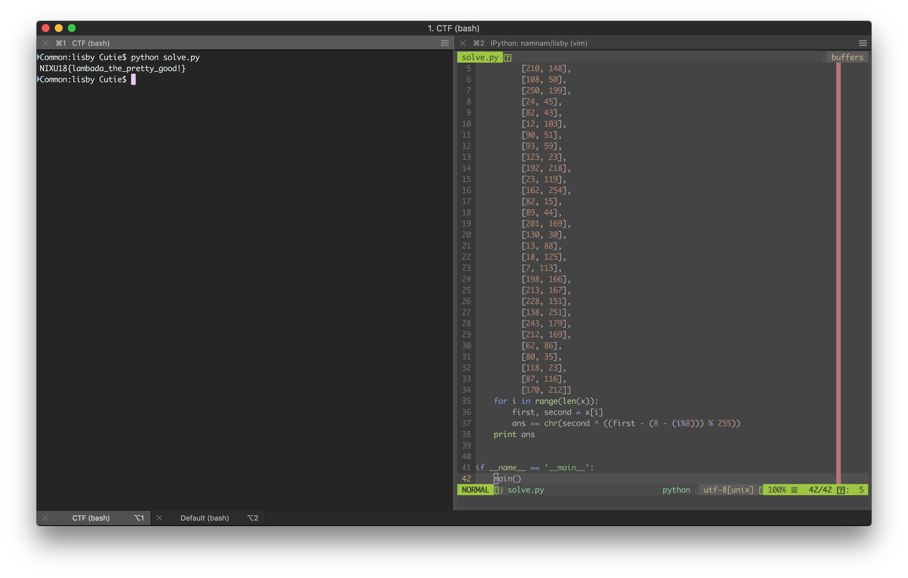

# The solution for "Lisby-3" challenge.

## Step
1. Using our decomiler we again dump the assembly and take a look a it. It seems there are a lot more functions in this one. 
2. We check the for new op codes and implement those in our execute function. 
3. We implement the new functions accoriding to the specifications and run the code again, we however fail to get the correct output, so
we go for analysing the code manually. 
4. After some time, we now what each tape/function is doing: 
5. So, we implement an quick python script that emulates the program and we get our flag.

## Flag
The flag that we obtained is NIXU18{lambada_the_pretty_good!}
