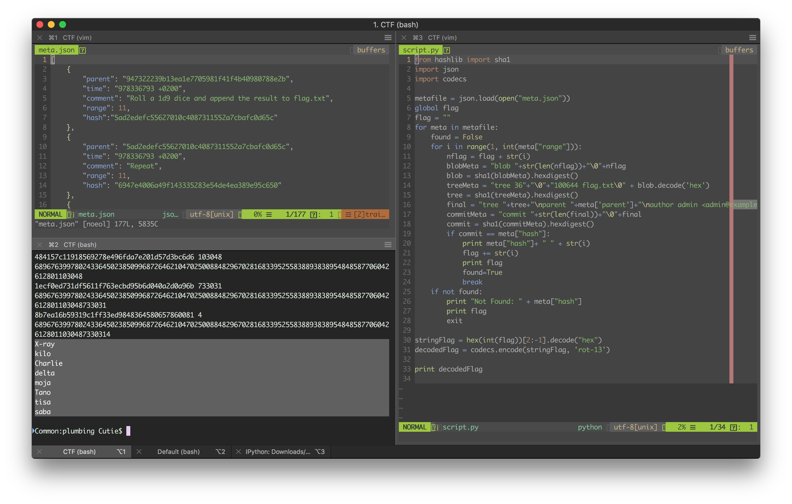
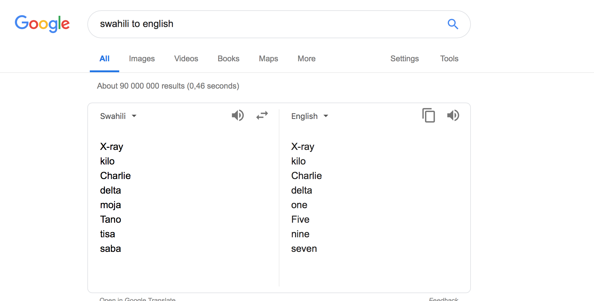
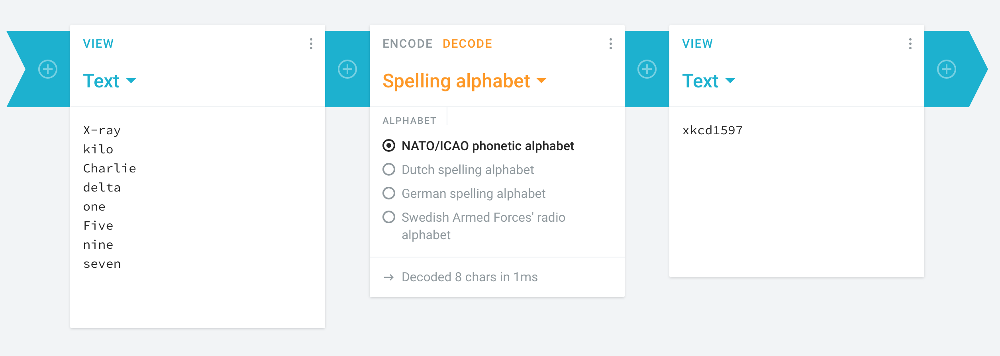

# The solution for "Plumbing" challenge.

## Step
1. We are faced with a git log with all of the data and description of the file from creation till the flag, so the first thing we look into
is how a git commit is constructed.
2. After some research, we write a python script that can reconstrunct the file given the commits as a meta data, we run the script and we get the the swahili text. 
3. We run that on google translate and we get the following.
4. We decode the phonetic alphabet and wrap it in NIXU{} to get the flag. 

## Flag
The flag that we obtained is NIXU{xkcd1597}
