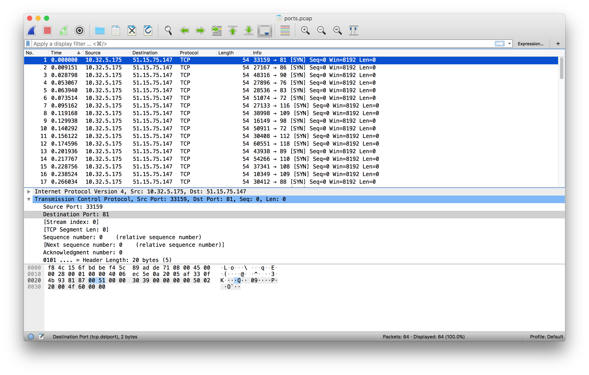
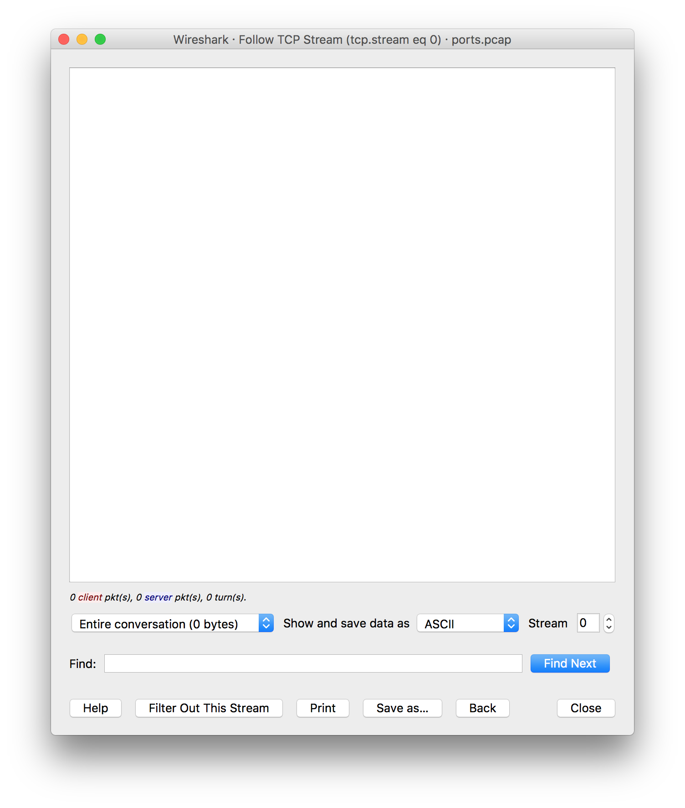
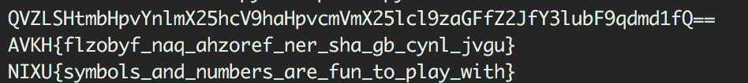

# My solution for "Port" challenge.

## TL;DR
Destination ports are ASCII, decode, and rot13 to get the flag.

## The steps:
1. First of all, we open the provided file ports.pcap in wireshark; 

We notice alot of TCP requests, we try to doing follow on the stream but there is nothing. 

2. On closer inspection, We notice that the dports numbers are very interesting. They look like ASCII representation of characters;
3. Let's create a script to get that string! 
4. Oh, now that looks like base64 encrypted, lets decode that.
5. This looks like the flag, but in the wrong order? We try a quit rot13 and we have have the flag!
6. Lets modify the script to just output the flag for us. 

## The flag
The flag for this challenge is NIXU{symbols_and_numbers_are_fun_to_play_with}
