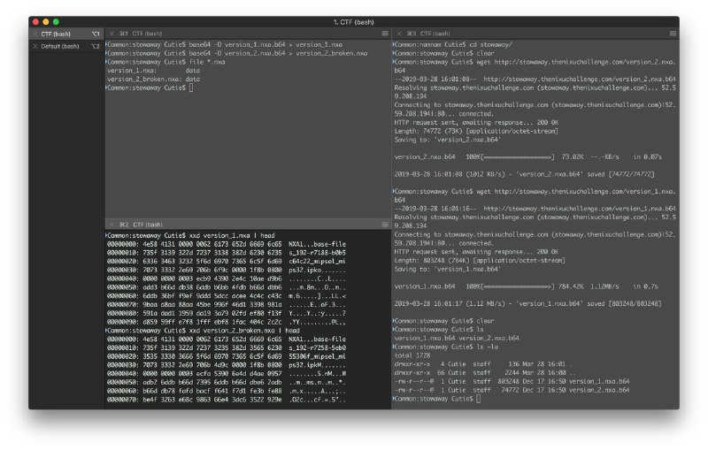
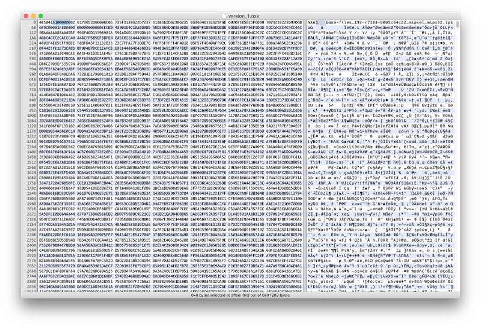
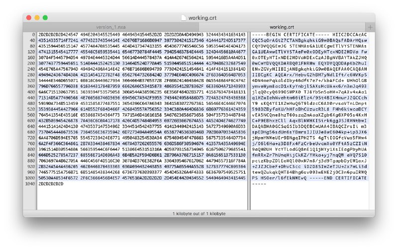
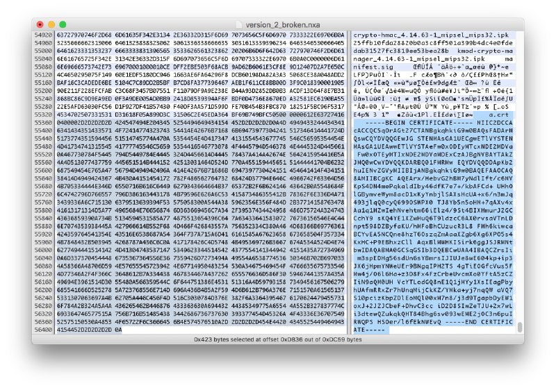
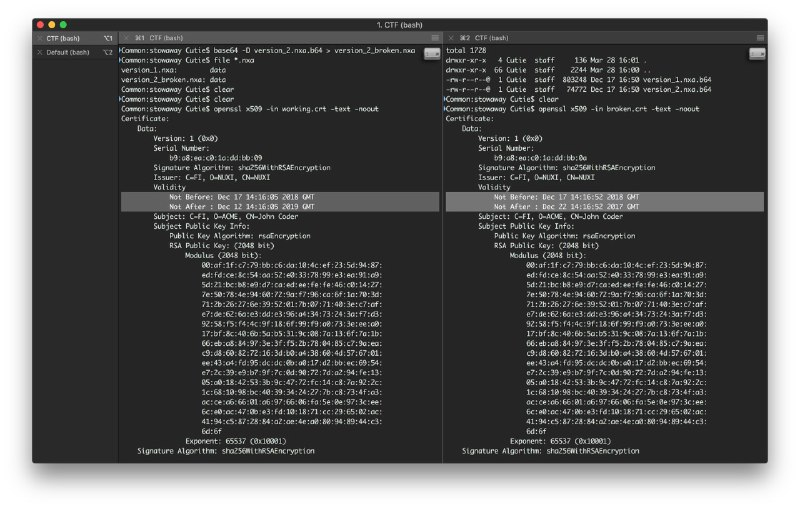
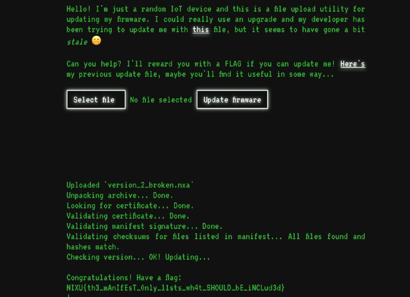

# The steps for solving the Stowaway challenge 

1. First of all, we opened the available files and understood the problem. 
2. The file is base64 encoding configuration. We need to decode from base 64 to human-readable file (.nxa files). 
3. We looked at the binary of .nxa files using xcd. The header of files states that the file is NXA. 
4. We take a look inside the binary files. We found out the beginning and end of two certificate files. 
5. Let's extract the certificate files. 
6. We checked the certificates and found out that they are not valid, since the date already expired.  
7. After a long tryouts and analyzing the gile structure, we see the common structure of packing and unpacking, where 1 byte before the title specifies the content and 1 byte specifies the size of string. 
8. We found out that the IoT device takes the first certificate found, therefore, if we add and change the name of certificate that needs to match with manifest with checksums. We rename the certificate name to coder.cert instead of john.cert. 
9. Now the IoT device can get the certificate and update itself. 

# The flag 
NIXU{th3_mAnIfEsT_0nly_l1sts_wh4t_SHOULD_bE_iNCLud3d}
